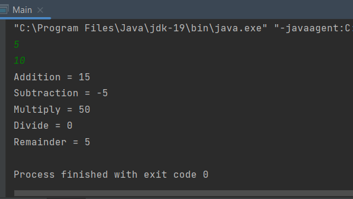
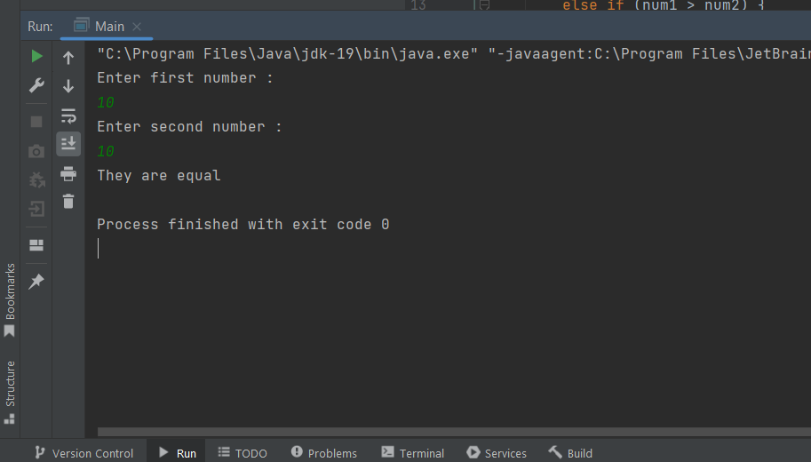
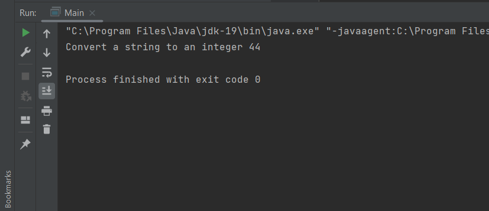
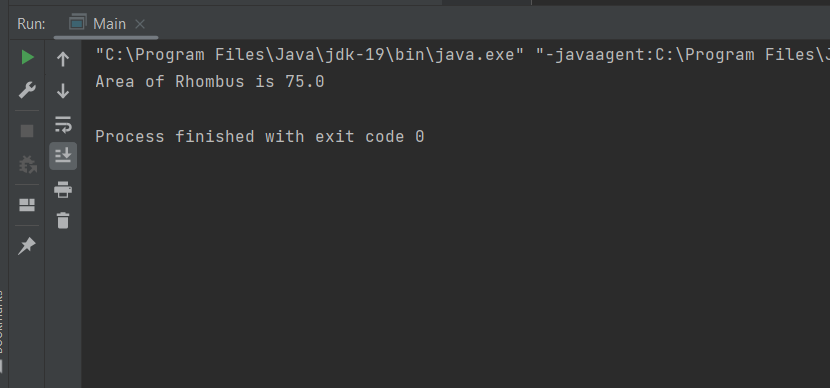
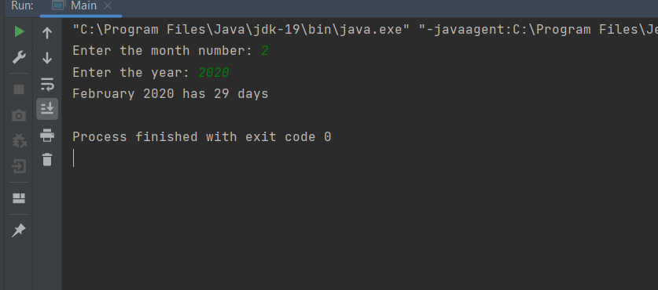
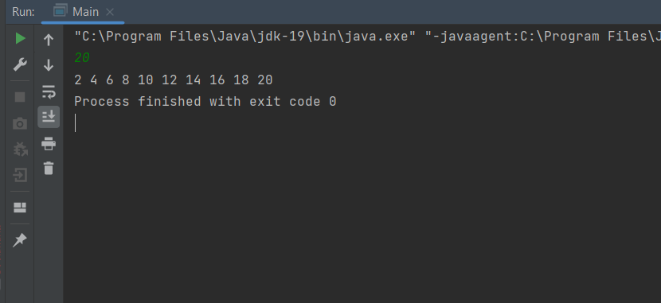
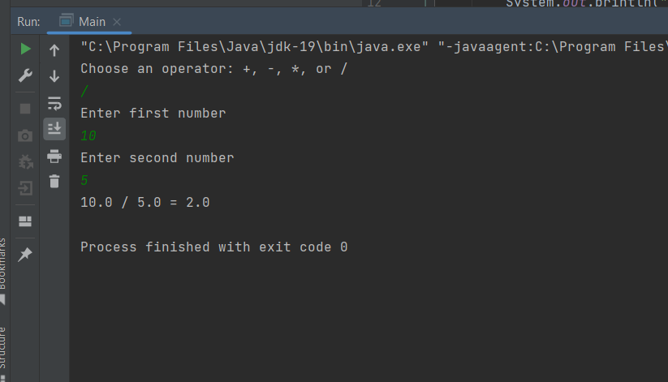
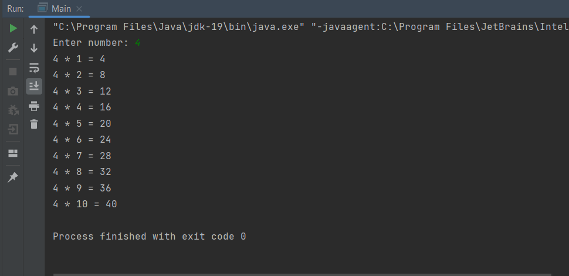

# java-assignment

## 1.Write a Java program to print the sum, multiply, subtract, divide and remainder of two numbers.

### Program:-
```
import java.util.Scanner;
public class Main {
    public static void main(String[] args)
    {
        int a,b,add,sub,div,mul,rem;
        Scanner in = new Scanner(System.in);
        a = in.nextInt();
        b = in.nextInt();
        add=a+b;
        sub=a-b;
        mul=a*b;
        div=a/b;
        rem=a%b;
        System.out.println("Addition = "+add);
        System.out.println("Subtraction = "+sub);
        System.out.println("Multiply = "+mul);
        System.out.println("Divide = "+div);
        System.out.println("Remainder = "+rem);
    }
}
```

### output:


## 2.Write a Java program to compare two numbers.

### Program:-
```
import java.util.*;
public class Main {
    public static void main(String [] args){
        Scanner nums= new Scanner(System.in);
        System.out.println("Enter first number :");
        int num1= nums.nextInt();
        System.out.println("Enter second number :");
        int num2=nums.nextInt();

        if (num1 == num2){
            System.out.println("They are equal");
        }
        else if (num1 > num2) {
            System.out.println(num1+ " is GREATER than " +num2);
        }
        else {
            System.out.println(num2+" is GREATER than "+ num1);
        }
    }
}

```
## Output:-


## 3.Write a Java program to convert a string to an integer.

## Program:-
```
public class Main 
{
    public static void main(String[] args)
    {
        String a="44";
        int b=Integer.parseInt(a);
        System.out.println("Convert a string to an integer "+b);
    }
}
```
## Output:-


## 4.Write a Java Program to find area of rhombus

### Program:-
```
public class Main
{
    public static void main(String args[])
    {
        float a=5,b=30;
        float Area_of_rhombus;
        Area_of_rhombus=(a*b)/2;
        System.out.println("Area of Rhombus is "+Area_of_rhombus);
    }
}
```
### Output:-


## 5.Write a Java program to find the number of days in a month.

### Program:-
```
import java.util.Scanner;
public class Main {
    public static void main(String[] args)
    {

        Scanner input = new Scanner(System.in);

        int Days=0;
        String Name = " ";

        System.out.print("Enter the month number: ");
        int month = input.nextInt();

        System.out.print("Enter the year: ");
        int year = input.nextInt();

        switch (month) {
            case 1:
                Name = "January";
                Days = 31;
                break;
            case 2:
                Name = "February";
                if ((year % 400 == 0)||((year % 4 == 0)&&(year % 100 != 0))) {
                    Days= 29;
                } else {
                    Days = 28;
                }
                break;
            case 3:
                Name = "March";
                Days = 31;
                break;
            case 4:
                Name = "April";
                Days = 30;
                break;
            case 5:
                Name = "May";
                Days = 31;
                break;
            case 6:
                Name = "June";
                Days = 30;
                break;
            case 7:
                Name = "July";
                Days = 31;
                break;
            case 8:
                Name = "August";
                Days = 31;
                break;
            case 9:
                Name = "September";
                Days = 30;
                break;
            case 10:
                Name = "October";
                Days = 31;
                break;
            case 11:
                Name = "November";
                Days = 30;
                break;
            case 12:
                Name = "December";
                Days = 31;
        }
        System.out.println(Name + " " + year + " has " + Days + " days");
    }
}
```
### Output:-


## 6.Write a Java program to print the even numbers from 1 to 20.

### Program:-
```
import java.util.Scanner;
public class Main {
    public static void main(String[] args)
    {
            Scanner input = new Scanner(System.in);
            int a = input.nextInt();
            for (int i=1; i<=a; i++)
            {
                if (i%2==0)
                {
                    System.out.print(i+" ");
                }
            }
        }
    }
```
### Output:-


## 7.Write a Java program to create a simple calculator.

### Program:-
```
import java.util.Scanner;
public class Main {
    public static void main(String[] args) {

        char operator;
        double num1, num2, result;
        Scanner input = new Scanner(System.in);
        System.out.println("Choose an operator: +, -, *, or /");
        operator = input.next().charAt(0);
        System.out.println("Enter first number");
        num1 = input.nextDouble();
        System.out.println("Enter second number");
        num2 = input.nextDouble();

        switch (operator) {

            case '+':
                result = num1 + num2;
                System.out.println(num1 + " + " + num2 + " = " + result);
                break;

            case '-':
                result = num1 - num2;
                System.out.println(num1 + " - " + num2 + " = " + result);
                break;

            case '*':
                result = num1 * num2;
                System.out.println(num1 + " * " + num2 + " = " + result);
                break;

            case '/':
                result = num1 / num2;
                System.out.println(num1 + " / " + num2 + " = " + result);
                break;

            default:
                System.out.println("Invalid operator!");
                break;
        }
    }
}
```

### Output:-


## 8.Write a Java program to print multiplication table of given number.

### Program:-
````
import java.util.Scanner;
public class Main {
    public static void main(String[] args)
    {
        Scanner s = new Scanner(System.in);
        System.out.print("Enter number: ");
        int n=s.nextInt();
        for(int i=1;i<=10;i++)
        {
            System.out.println(n+" * "+i+" = "+n*i);
        }
    }
}

````

### Output:-
